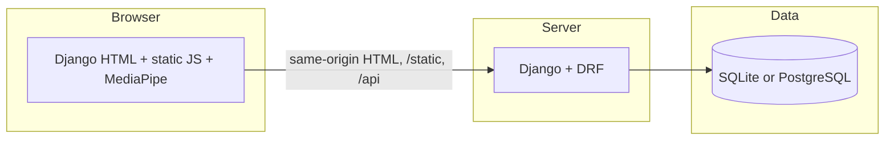

# Zentrol — system architecture

## Overview

Zentrol is a gesture-controlled presentation system. The **browser** runs MediaPipe and the slide UI loaded from **Django-rendered HTML** (`templates/`) and **`/static`** (JavaScript, CSS, MediaPipe assets). **Django** serves pages at `/`, `/presentation/`, **`/static`**, **JSON APIs** under `/api/`, and persists data in **SQLite** (local) or **PostgreSQL** (recommended for production).

## Repository layout

| Path | Role |
|------|------|
| `config/`, `gestures/`, `moodle/`, `lip2speech/` | Django project and apps |
| `templates/` | `home.html`, `presentation.html`, dashboard, auth, Moodle launch |
| `static/` | Shared static assets (MediaPipe, `js/`, `media/`) served at `/static/` |
| `docs/` | Architecture, deployment, API inventory |

## API versioning & docs

- **Versioned JSON API**: `/api/v1/...` (e.g. `GET /api/v1/health/`).
- **Existing DRF + JSON**: under `/api/` (router, `log-gesture`, etc.).
- **OpenAPI / Swagger**: `/api/schema/`, `/api/docs/` — **enabled when `DEBUG=True` or `SPECTACULAR_PUBLIC=True`**. In production they are off by default to reduce exposure.

## Security (practical)

- **CORS** — `CORS_ALLOWED_ORIGINS` should list **origins that call your API** (same-origin Django is typical; add others if you embed or split hosts).
- **CSRF** — `CSRF_TRUSTED_ORIGINS` aligned with your public site URL(s).
- **Gesture logging** — `POST /api/log-gesture/` is throttled (`gesture_log` scope). If `GESTURE_LOG_SHARED_SECRET` is set, clients must send it in header `X-Zentrol-Gesture-Log-Secret` (optional in `gesture_engine.js` via `window.__ZENTROL_GESTURE_LOG_SECRET__`). This is **not** a substitute for user auth; it reduces drive-by script abuse.
- **Gesture logs (DRF)** — `GestureLogViewSet` requires **authentication** for CRUD where configured.
- **ALLOWED_HOSTS** — must be explicit in production (no `*`).
- **Production framing** — when `DEBUG=False`, `Content-Security-Policy: frame-ancestors` is derived from `LTI_FRAME_ANCESTORS` plus `'self'` so Moodle can embed Zentrol; set Moodle origins explicitly.

## Auth (current vs future)

- **Today**: Anonymous health + throttled gesture log; authenticated DRF resources where `IsAuthenticated` is set.
- **MediaPipe / gestures**: Hand tracking stays **client-side**; the server receives gesture metadata and session identifiers.

## Environment variables

See root `.env.example`. Key ideas:

- `DATABASE_URL` — SQLite default; PostgreSQL via `docker-compose.yml` for parity.
- `CORS_ALLOWED_ORIGINS` / `CSRF_TRUSTED_ORIGINS` — match how you host the app.
- `GESTURE_LOG_SHARED_SECRET` — optional header check for gesture POST.
- `SPECTACULAR_PUBLIC` — expose OpenAPI when `DEBUG=False`.

## Template routes

| Route | Template | Notes |
|-------|----------|--------|
| `/` | `home.html` | Demo + auth links |
| `/presentation/` | `presentation.html` | Reveal + gestures |

## Further reading

- [DEPLOYMENT.md](./DEPLOYMENT.md) — local dev, Postgres, production hosting
- [API_INVENTORY.md](./API_INVENTORY.md) — templates vs API surface
